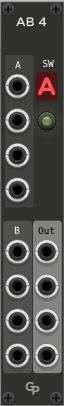

<h1>AB4 - Simple four way A/B switcher</h1>

**AB4** is a module in the GP plugin for VCV Rack 2

 &nbsp; &nbsp; &nbsp;

This module is a simple polyphonic A/B switcher. The four output signals are either fed from
the four A inputs signals or the four B inputs. A button controls the A/B selection, and an
indicator shows which group of inputs is selected. All channels of polyphonic input cables are
carried from the selected input to the output sockets.

AB4 does not distinguish between audio, CV or trigger signals. Please note that AB4 does not
understand which signals are triggers, which might need to be ended before switching. This
can lead to short bleeps when switching GATE signals through AB4.