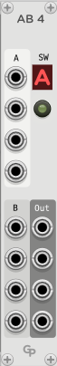

<h1>AB4 - Four Channel A/B Switcher</h1>

**AB4** is a module in the GP plugin for VCV Rack 2

 &nbsp; &nbsp; &nbsp;

This module is a polyphonic A/B switcher for audio and CV. The four output signals are either fed from
the four A inputs signals or the four B inputs.

A button controls the A/B selection, and an
indicator shows which group of inputs is selected. There is also a control voltage input to
control A/B switching under the A/B button.
Under the CV input there is a CV output that reflects the current state of the A/B switch. It can
also be used to daisychain AB4 modules.

The "CV A/B" input and the parameter button are combined with a logical OR
operation, so AB4 switches to B when either is active.

All channels of polyphonic input cables are
carried from the selected input to the output sockets.

AB4 does not distinguish between audio, CV or trigger signals. Please note that AB4 does not
understand which signals are gates that might need to be ended before switching. This
can lead to short bleeps when running GATE signals through AB4 and switching while playing.