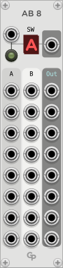
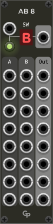

<h1>AB8 - Eight Channel A/B Switcher</h1>

**AB8** is a module in the GP plugin for VCV Rack 2

 &nbsp; &nbsp; &nbsp;

This module is a polyphonic A/B switcher for audio and CV. The eight output signals are either fed from
the eight A inputs signals or the eight B inputs.

A button controls the A/B selection, and an
indicator shows which group of inputs is selected. There is also a control voltage input to
control A/B switching in the top left corner of the front panel.
To the right auf the A/B display there is a CV output that reflects the current state of the A/B switch.
It can also be used to daisychain AB8 modules.

The "CV A/B" input and the parameter button are combined with a logical OR
operation, so AB8 switches to B when either is active.

All channels of polyphonic input cables are
carried from the selected input to the output sockets.

AB8 does not distinguish between audio, CV or trigger signals. Please note that AB8 does not
understand which signals are gates that might need to be ended before switching. This
can lead to short bleeps when running GATE signals through AB8 and switching while playing.