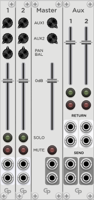
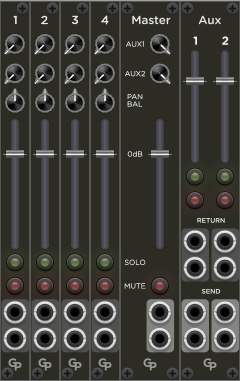

**Chain Mixer - Modular mixer using Daisy-Chained Mode**

  &nbsp; &nbsp; &nbsp; 

The Chain Mixer consists of three modules:

* Channel - an Input channel
* Master - the Master section 
* Aux - an optional Aux Send/Return section

Up to 16 Channel modules can be combined with one Master and one Aux section by putting them into adjacent slots in your rack.