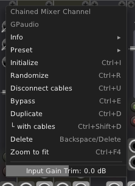

<h1>Chained Mixer — Modular Stereo Mixer</h1>

**Chained Mixer** is a group of modules in the GPaudio plugin for VCV Rack 2

&nbsp; &nbsp; &nbsp; 

<h2>Introduction</h2>

The Chained Mixer allows you to build customized stereo mixers with only the channels you need
to minimize rack real estate usage. It offers a Main output and two Aux send and return channels.

<h4>Modules</h4>

The following modules are available for the mixer:

* **Channel**: an input channel
* **Extended Channel**: an input channel with additional controls, direct out and CV control
* **Main**: the Main Output section
* **Aux**: an optional Aux Send/Return section

Up to 16 Channel and/or Extended Channel modules can be combined with one Main and one Aux
section by putting them into adjacent slots in your rack.

<h4>Mono and Stereo</h4>

All inputs and outputs are stereo but can also be used with mono signals by only connecting
one input or output port. The mixer recognizes if one or two ports are connected and
treats signals accordingly.

Therefore, you should NOT wire a mono signal source to both inputs in parallel. This
is not only unnecessary, but it also messes up the Panorama/Balance algorithms in the mixer.
Also, only connect one output if you only need a mono signal from the mixer.

<h4>Polyphony</h4>

The Chained Mixer accepts polyphonic input signals, but internal processing and all outputs
are monophonic. This is best suited for a mixer stage at the output of a patch. For mixing
inside a polyphonc synth voice, for example, between multiple oscillators and a filter or VCA,
you have to use a fully polyphonic mixer such as the Daisy Mix modules from QuantalAudio or
the Venom mixers, among others.

<h2>Channel Module</h2>

Use this module to provide input signals to the mixer.

Up to 16 Channel and or Extended Channel modules can be freely combined. Any additional
modules, counting from left to right, will be non-functional. Any disabled channels
will not show a channel number, and all controls will be dead.

<h3>Inputs</h3>

This module has two ports for a mono or stereo input signal.

If only one input port is connected, the mixer automatically treats the input as a
mono input with the Pan/Bal control working as a "Panorama" control. If both input
ports are connected, the mixer treats the channel as a stereo signal and Pan/Bal
applies a "Balance" curve. Do not wire mono signals to both ports, as this will
mess up the Panorama vs. Balance evaluation.

The input ports accept signals from polyphonic cables and sum together all polyphonic
channels before feeding them into the internal monophonic mixing buses.

<h3>Controls</h3>

Each channel has a **MUTE** and a **SOLO** button. Please note that the two buttons
do not interact because this would mess with MIDI mapping of the buttons. So you can
have a channel in Mute and Solo simultaneously, in which case it will be muted.

If you hold down the CTRL/CMD- and SHIFT-keys while clicking a //Mute// or //Solo//
button, all other channels will be unmuted/unsoloed.

If you hold down only the CTRL/CMD-key while clicking a //Solo// button, all other channels
also get unsoloed, but their Solo state is remembered internally. If you clicl //Solo//
again on the same channel with CTRL/CMD held down, the saved Solo state in the other channels
is restored, allowing you to toggle between two Solo scenarios.

Neither the CTRL/CMD + SHIFT nor the CTRL/CMD modifiers work on or affect Mute and Solo
on the Chain Mixer Aux module.

The **FADER** controls the signal gain. The 0 dB position is marked, and the maximum gain
value is +12 dB. The fader is not dB-linear, instead it offers the most precise gain
control near the 0dB mark.

The **PAN/BAL** knob controls the position of the signal in the stereo field. If a stereo
source is connected, it will work as a Balance control with 0 dB gain in the middle position
and decreasing level of one channel to either side. If a mono input is connected to one of
the input ports, it will work as a panorama control with a gain of -3 dB in the middle
position to approximate equal loadness across the panning range.

**AUX1** and **AUX2** are two independent post-fader busses that are usually used to
hook up effect devices such as a reverb. Both AUX knobs provide a maximum gain of 0 dB.

<h3>Trim (Context Menu)</h3>

The right-click context menu for the channel modules offers an **Input Gain Trim** slider.

It can be used to bring very loud or quiet signals to a similar level as the other
inputs for more intuitive mixing with the faders. Also, the channel faders offer the finest
control around the 0 dB mark, and Input Gain Trim can be used to bring the signal into that
range. Trim has a range of +/- 18dB.

<h2>Extended Channel Module</h2>

The Extended Channel module offers all the features of the Channel module plus several
additional ports and controls in the right half of the front panel.

Up to 16 Channel and or Extended Channel modules can be freely combined. Any additional
modules, counting from left to right, will be non-functional. Any disabled channels
will not show a channel number, and all controls will be dead.

<h3>Additional Inputs and Outputs</h3>

<h4>Control Voltage</h4>

Next to the Pan/Bal knob is a CV input for **Panorama** or **Balance**. It accepts unipolar
(0..10 V) and bipolar (+/- 5 V) control voltages. The value is added to the knob value.
10 Volts cover the whole range from left to right, so with unipolar CV you can turn the
knob to full left and pan from left to with 0 to 10 V. With a bipolar CV, set the knob
to the middle position and pan left with -5 V and right with + 5 V.

The CV input next to the fader provides a **Gain** CV input. The Gain input expects
a unipolar 0..10 V signal. The Gain CV input controls a gain element in series with the
fader. The control for the gain element is applied in a linear fashion with 0 V meaning
"Off" and 10 V meaning 0 dB (unity gain). Since the element is in series with the fader,
the effective gain for the 0..10 V CV range goes from "Off" to the gain value set on the
fader.

Next to the Solo and Mute buttons are CV inputs for **SOLO** and **MUTE**. Any voltage 
above 1 V on these inputs soloes or mutes the channel. The CV control for Solo and Mute
is combined with the state of the Solo and Mute buttons using a logical OR operation.

<h4>Outputs</h4>

The Extended Channel module provides a **Direct Out** signal. This signal is post-//Trim// (see
below), Pan/Bal, Mute, Solo and the fader. If the "Main Apply Fader" parameter is set,
the level of Direct Out in addition reflects the gain defined by the fader and Mute button
in the Main module.

<h3>Additional Parameters</h3>

There are two **PRE** buttons next to the Aux send controls. If activated, the respective
Aux send signals are not influenced by the channel fader or Mute button. However, the Aux
send signal does get muted if another channel is in Solo mode. The PRE buttons act directly
on the Aux signals without a slew rate, so changing Pre can result in audible clicks.

The **MAIN APPLY FADER** controls if the Direct Out signal follows the fader and Mute 
button of the Main module. If set, the Direct Out signal goes up and down in level together
with everything else in the mixer if the main fader is moved or the main module is muted.
If not set, Direct Out is only controlled by Trim, Pan/Bal, Mute, Solo and the channel
fader.

The **MAIN MUTE** parameter allows muting the channel from the Main output signal only.
If Main is muted, the channel will still feed the Aux send outputs and its own Direct Out port.
This could be used, for example, to wire a signal to a rear surround speaker while still
controlling it like any other channel on the mixer.

<h2>Main Module</h2>

The Main module provides the main stereo or mono output of the mixer.

There has to be exactly one Main module in an adjacent group of Chained Mixer modules.
If two or more Main modules are detected, only the leftmost module of them will be active.
If no Main module is present, the mixer will not work.

<h3>Outputs</h3>

The Main module provides two ports for the stereo output signal. The output signal is
monophonic, any polyphonic signals coming into the Channel or Aux modules are summed into
a monophonic signal before mixing takes place.

<h3>Controls</h3>

The **MUTE** button shuts off the output signal.

The **FADER** controls the audio level on the outputs. The 0dB position is marked
and the gain can be adjusted up to +12 dB. The fader is not dB-linear, instead it offers
the most precise gain control around the 0dB mark.

**AUX1** and **AUX2** are the overall gain controls for the AUX bus send outputs. Their
maximum gain is 0 dB.

<h3>OVR Light</h3>

Above the fader is an **OVR** light. It reacts to peaks of the main audio output signal
and lights up when a sample exceeds the threshold for the OVR light. The OVR light is held
for a short while, so it can be noticed on very short peaks.

The threshold can be set via the module's context menu. Right-click on the module and
select a threshold from the "OVR Threshold" submenu. Possible values are:
* **10 V**: This is the maximum defined voltage value in Rack, although actual voltages can be 
higher.
* **+3 dBfs**: This vaotage is 3 dB above the maximum defined bipolar audio voltage in Rack and 
 corresponds to about 7.06 V
* **0 dBfs**: The default range for audio signals in Rack is +/-5 V. This is considered 0 dBfs 
(dB relative to fullscale). This is the default setting for the OVR light threshold.
* **-3 dBfs**: A threshold 3 dB below the 5 V full scale value which is about 3.54 V.
* **-6 dBfs**: This value is 6 dB below +/-5 V (about 2.51 V).

<h2>Aux Module</h2>

The Aux module provides the connections for the two AUX devices as well as some controls for
them. Only one Aux module can be active in an adjacent group of Chained Mixer modules. If two
or more Aux modules are detected, only the leftmost module of them will be active.

<h3>Inputs and Outputs</h3>

For each of the AUX devices there is a stereo set of **SEND** output posts and a
stereo set of **RETURN** input ports. It is possible to use Send and/or Return in mono, and
the mixer will handle summing and panning accordingly.

The **RETURN** inputs will accept polyphonic cables and create an internal monophonic sum
from them before they are mixed to the Main module's output. The **SEND** outputs provide a
monophonic signal.

<h3>Controls</h3>

Like the Channel module, the Aux module has **SOLO** and **MUTE** buttons that affect
the signals from the Return inputs.

If you hold down the CTRL/CMD- and SHIFT-keys while clicking a //Mute// or //Solo//
button, the other return channel will be unmuted/unsoloed.

If you hold down only the CTRL/CMD-key while clicking a //Solo// button, the other return channel
also gets unsoloed, but its Solo state is remembered internally. If you click //Solo//
again on the same channel with CTRL/CMD held down, that saved Solo state is restored, allowing
you to toggle between soloing the two return channels.

The CTRL/CMD and SHIFT modifiers in the Aux module do not affect mute or Solo in the Channel
or Extended Channel modules.

A **FADER** for each Aux Return signal adjusts its gain before it gets mixed into
the output signal of the Main module. The 0 dB position is marked, and the maximum gain is +12 dB.
