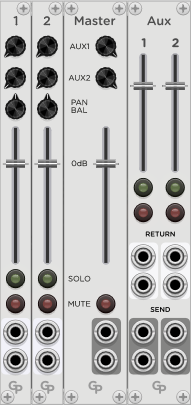

<h1>Chained Mixer - Modular Stereo Mixer</h1>

  &nbsp; &nbsp; &nbsp; 

<h2>Available Modules</h2>

The Chain Mixer consists of three modules:

* Channel - an Input channel
* Master - the Master section 
* Aux - an optional Aux Send/Return section

Up to 16 Channel modules can be combined with one Master and one Aux section by putting them into adjacent slots in your rack.

<h2>Channel Module</h2>

<h3>Sockets</h3>

This module has two sockets for a mono or stereo input signal.

<h3>Parameters</h3>

Each channel has a **MUTE** and a **SOLO** button. Please note that the two buttons
do not interact because this would mess with MIDI mapping of the buttons. So you can
have a channel in Mute and Solo simultaneously, in which case it will be muted.

The **FADER** controls the signal gain. The 0 dB position is marked, and the maximum gain
value is +12 dB.

The **PAN/BAL** knob controls the position of the signal in the stereo field. If a stereo
source is connected, it will work as a Balance control with 0 dB gain in the middle position
and decreasing level of one channel to either side. If a mono input is connected to one of
the input sockets, it will work as a panorama control with a gain of -3 dB in the middle
position to approximate equal loadness across the panning range.

**AUX1** and **AUX2** are two independent post-fader busses that are usually used to
hook up effect devices such as a reverb. Both AUX knobs provide a maximum gain of 0 dB.

Channel modules are numbered from left to right, if more than the supported 16 channels
are combined, the extra channels will not show a number and will be disabled.

<h2>Master Module</h2>

<h3>Sockets</h3>

The Master module provides two sockets for the stereo output signal. Only one Master module
can be active in an adjacent group of Chained Mixer modules. If two or more Master modules are detected,
only the leftmost module of them will be active.

<h3>Parameters</h3>

The **MUTE** button shuts off the output signal.

The **FADER** controls the audio level on the output sockets. The 0dB position is marked
and the gain can be adjusted up to +12 dB.

**AUX1** and **AUX2** are the overall gain controls for the AUX bus send outputs. Their maximum gain is 0 dB.

<h2>Aux Module</h2>

The Aux module provides the connections for the two AUX devices as well as some controls for
them. Only one Aux module can be active in an adjacent group of Chained Mixer modules. If two
or more Aux modules are detected, only the leftmost module of them will be active.

<h3>Sockets</h3>

For each of the AUX devices there is a stereo set of **SEND** output sockets and a
stereo set of **RETURN** input sockets. It is possible to use only one of the Send and/or Return
sockets, the mixer will handle summing and panning accordingly.

<h3>Parameters</h3>

Like the Channel module, the Aux module has **SOLO** and **MUTE** buttons that affect
the inpot signals from the Return sockets.

A **FADER** for each Aux Return signal adjusts its gain before it gets mixed into
the output signal of the Master module. The 0 dB position is marked, and the maximum gain is +12 dB.
