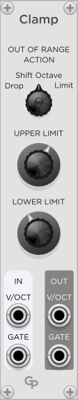
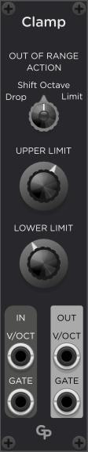

<h1>Clamp — Volt per Octave Limiter</h1>

**Clamp** is a module in the GPaaudio plugin for VCV Rack 2

 &nbsp; &nbsp; &nbsp;

Clamp is a fully polyphonic module that can limit incoming V/Oct control voltages to
a range between two spefifier musical notes. Out-of-range notes can be
* dropped
* shifted in octave until they fall into the specified note range or
* set to the nearest allowed note.

<h2>Inputs and Outputs</h2>

Clamp has two input and two output ports for V/Oct and Gate control voltages.

<h3>V/OCT</H3>

The incoming V/Oct signal is constantly evaluated and compared to the lower
and upper thresholds. It is modified according to the "Out of Range Action"
and output to the V/OCT output port.

<h3>GATE</h3>

The incoming Gate signal gets forwarded to the Gate output port, **unless**
the algorithm decided to drop a note. See below.

<h2>Controls</h2>

The **LOWER LIMIT** and **UPPER LIMIT** knobs define the allowed range of
V/Oct on the output. When tweaking the knob, the note is displayed along with
its octave (i.e., C4). When entering text (right-click), you can also
enter frequency values that will be automatically adjusted to the nearest
note.

If the upper limit is lower than the lower limit, an error light will light
up in the "OUT OF RANGE ACTION"-Knob. In "Shift Octave"-mode (see below), the
error light lights up if there are less than 12 halftones from lower to upper
limit.

The **"OUT OF RANGE ACTION"** knob offers three operation modes for when an
incoming V/Oct value is outside the selected range:

* **Drop** sets the outgoing Gate signal to 0 V whenever the input V/Oct signal
is out of range. For this to work, you should run your Gate signal through Clamp,
for example, from a MIDi-CV module into Clamp and from Clamp to your ADSR
envelope generator.
* **Shift Octave** adjusts the octave of the notes until they fit into the
window between lower and upper limits. If the range between the limits is
smaller than 12 halftones and there is no fit for the current input note,
it gets dropped by setting the Gate output to 0 V. For this to work, you must
also run your Gate signal through Clamp.
* **Limit** sets any note below the lower limit to the lower limit and
any note above the upper limit to the upper limit. Gate is always forwarded
without modification from input to output.