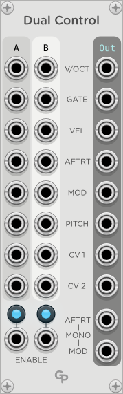
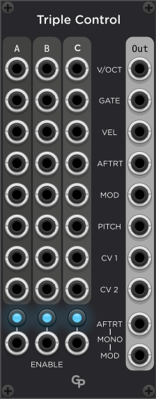

<h1>DualControl / TripleControl — Merge Controllers and Sequencers</h1>

**Dual Control** and **Triple Control** are modules in the GPaudio plugin for VCV Rack 2

 &nbsp; &nbsp; &nbsp;

DualControl and TripleControl allow you to play your synth from two or three
MIDI keyboards, MPE Controllers, sequencers or other devices simultaneously. Both
modules are fully polyphonic.

<h2>Channel Allocation</h2>

On every Gate signal from a polyphonic channel in one of the input colums
Dual/TripleControl try to assign a channel on the polyphonic output stream.
If all polyphonic output channels are busy (meaning they have an active Gate signal),
the note is dropped. Otherwise, the polyphonic output channel is assigned on a
"Least Recently Used" basis by choosing the output channel that had an inactive Gate
output for the longest time.

For monophonic input devices, an output channel is assigned on the first GATE
signal received. After that, all notes and control signals will be sent to that output
channel. This ensures that typical operations from monophonic controllers like glides
work as intended.

Most of the time the input polyphonic channel will not be the same as the output
channel, as Dual Control and Triple Control shuffle output polyphony channels around
to accomodate input signals from two or three devices.

<h2>Inputs and Outputs</h2>

Dual Control has two sets of identical input ports labeled A and B, whereas
Triple Cnotrol adds a C column of inputs. The columns correspond to two or three
controller devices. These can be keyboards, MPE controllers or sequencers, for
example.

There is one column of outputs carrying the merged signals from the input
devices.

If any input port carries a monophonic modulation, aftertouch or CV signal,
that signal will be forwarded to all channels mapped to the respective input
device as there is no longer a "channel one" for each input device.

The following ports are common to all columns:

<h3>V/OCT</H3>

The V/Octave control voltage.

<h3>GATE</h3>

The GATE signal. Everytime the gate signal rises from below 1 V to above 1 V, a
free output channel is assigned to the repective input device and channel using
a "Least Recently Used approach". If there is no free output channel, the input
note is ignored.

<h3>VEL</h3>

The velocity of the note.

<h3>AFTRT</h3>

An aftertouch signal. If a monophonic CV is received (channel aftertouch) from
a device, it will be forwarded to all outputs channels assigned to inputs from that
device, making it a polyphonic aftertouch signal. However, all mapped output channels
will receive the same aftertouch signal.

A polyphonic aftertouch signal on the input gets forwarded as polyphonic aftertouch
to the mapped output channel only.

<h3>MOD</h3>

A Modulation signal. If a monophonic CV is received (for example, from a modulation wheel
on a MIDI keyboard) from a device, it will be forwarded to all output channels assigned
to inputs from that device, making it a polyphonic modulation signal. However, all
mapped output channels will receive the same modulation signal. 

A polyphonic modulation signal (for example, from an MPE controller) on the input gets
forwarded as polyphonic modulation to the mapped output channel only.

<h3>PITCH</h3>

A pitch bend signal. Many MIDI modules already factor any pitch bends into V/Octave
by default. But there are cases where a separate pich bend signal makes sense to use.

<h3>CV1 and CV2</h3>

Two additional control voltages can be mapped through Dual or Triple Control.
These could contain addition parameters from an MPE controller, for example.

<h3>AFTRT and MOD MONO outputs</h3>

These two outputs carry a monophonic aftertouch and modulation signal on
channel 1. These voltages are the maximum values of all aftertouch/modulation
input voltages received on mapped input channels.

In addition, the modulation mono output also considers any monophonic modulation
input signal, even if no channel is mapped for inputs from the device. Thus,
you can use the modulation wheel of a keyboard to affect the modulation of notes
coming from another device.

<h3>ENABLE</h3>

These CV inputs enable a device if the control voltage is above 1 V. The CV inputs
and the Enable buttons are combined in a logical OR operation.

<h2>Controls</h2>

<h3>ENABLE buttons</h3>

Each input column has an Enable button under the column. Inputs from the device
are only mapped if the device is enabled either by this button or a control voltage
on the Enable input.

<h3>Polyphonic Output Channels (Menu)</h3>

The right-click menu offers an option to set the number of channels on the
polyphonic output ports. It defaults to 16. If you set it too low, you could
lose notes coming from the input devices. Since the overall number cannot
exceed 16 in Rack, in many cases you will not be able to map enough channels
to map all input devices sending notes at their full channel capacity
simultaneously. 

