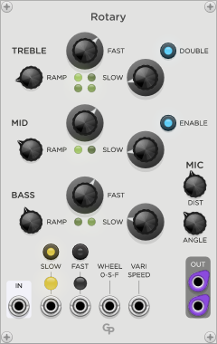
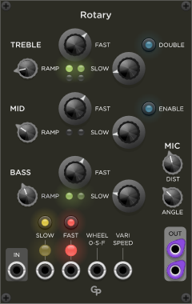

<h1>Rotary</h1>

**Rotary** is a module in the GP plugin for VCV Rack 2

 &nbsp; &nbsp; &nbsp;

<h2>Features</h2>

Rotary simulates the effect of a rotating speaker cabinet. Multiple speakers for different frequency
bands rotate at different speeds and have different ramp times for the speakers to get up to speed.
Compared to the classic hardware cabinets most often seen with tonewheel organs, Rotary offers a few
enhancements to provide more complex sound options:
* In addition to the usual two-way crossover with a bass speaker and a treble horn, there is an option
for a three-way crossover with an additional midrange speaker with its own rotating speed and ramp time.
* An optional second treble horn can be activated, spinning at a slightly different speed.
* In addition to the common Slow and Fast settings, Rotary also supports complete control over the rotation speed
with a VariSpeed CV input.

The position of the microphones for the stereo output can be adjusted in distance and angle between the
microphones.

Slow and Fast mode can be selected in three ways:
* Buttons on the Rotary front panel
* CV inputs for Slow and Fast
* With a CV input for a modulation wheel or any other CV source.

Two large lights above the CV inputs show if slow speed (yellow) or fast speed (red) is selected.

<h2>Sockets</h2>

* The mono input signal is fed into the **IN** socket in the lower left corner
of the front panel. The **IN** socket will accept all signals from polyphonic cables
and sum them together before they are processed.
* The processed signals are provided in the **OUT** section in the lower right corner.
Rotary provides left and right monophonoic audio signals.
* The **Slow** and **Fast** CV inputs activate the respective rotating speeds. Both
CV input states are logical ORed with the values of the respective buttons and the
Wheel CV input state. Fast speed has priority over slow speed.
* The **WHEEL 0-S-F** CV input is meant to be used with a modulation wheel, but of
course can be controlled by any CV source. It is not a linear speed control, instead
values between 33% and 66% (of 10 Volts) select slow speed, values above 66% select fast
speed.
* The **VARISPEED** CV input offers full control over rotating speed. Voltages
between 0 V and 10 V are translated into 0 to 100 percent of the Fast RPM settings
of each frequency band. If a cable is connected to the Varispeed CV input, all Slow
and Fast states controlled by buttons or CV are ignored and the Slow and Fast lights
disappear.

<h2>Parameters</h2>

<h3>Frequency Bands</h3>

The front panel shows three frequency bands **TREBLE**, **MID** and **BASS**. Each
band has knobs for Ramp, Slow and Fast. The Treble and Mid bands have additional
parameters.

<h4>RAMP knob</h4>

The **RAMP** parameter determines the time it takes for the speaker to reach
the desired rotation speed. Braking takes about 25% longer than the given RAMP
acceleration time. Only braking from Fast mode to Slow mode happens significantly
faster.

<h4>SLOW and FAST knobs</h4>

The **SLOW** and **FAST** knobs control the rotation speeds of the speaker in the
respective mode. The speed is controller in RPM (rotations per minute).

<h4>DOUBLE button (Treble only)</h4>

The **DOUBLE** button in the Treble section activates a second rotating horn in the treble section.
It's Slow and Fast speeds and Ramp time are slightly different from the first
horn. Therefore, the two horns go out of sync quickly, providing a more complex rich
sound. Turning Double on or off can result in a little click, so the parameter should not
be used for automation while audio is playing.

<h4>ENABLE button (Mid only)</h4>

The **ENABLE** button in the Mid section activates the three-way crossover with the midrange
speaker. Classic rotating speaker cabinets only have two speakers. If Enable is off, the
crossover frequency is 800 Hz. In three-way mode (Enable On) the crossover points are at
250 Hz and 2000 Hz. Turning Enable on or off can result in an audible click, so the parameter
should not be used for automation while audio is playing.

<h3>Other Parameters</h3>

<h4>FAST and SLOW buttons</h4>

The **FAST** and **SLOW** buttons select Slow or Fast mode. They are logical ORed with the
respective CV inputs and Wheel input. If both are one, Fast mode is selected.

<h4>MIC DIST knob</h4>

The **DIST** knob controls the distance between the microphones and the circumfence of
the rotating speaker circle. It can be adjusted in the range between 0.1 meters (about 4")
and 1 meter (about 3'4"). Please note that in the interest of the best possible latency,
the distance knob does not add any additional delay to the audio signal. The audio delay
always varies between 0.1 ms and about 1.15 ms.

The purpose of the MIC Dist parameter is to control the amount of gain modulation. The
closer you are, the more the audio level varies as the speaker sweeps by. Since the
virtual microphones for left and right are positioned at an angle, this also means that the
stereo effect is more pronounced at a closer distance.

<h4>MIC ANGLE knob</h4>

The **ANGLE** knob defines the angle between the microphones for the left and right outputs.
The angle can be varied between 90 and 180 degrees. The maximum value produces a "ping pong"
stereo effect, especially at close distances. Smaller angles produce a more subtle effect.

<h2>Notes</h2>

While Rotary emulates the effect of rotating speakers pretty convincingly to the untrained ear,
it is by no means a true physical simulation. Various shortcuts have been taken in the interest
of keeping CPU usage at bay.

Besides, there is no emulation of the tube amplifier in the classic Leslie cabinets or of
speaker characteristics. Being in a modular synthesizer, these can be added externally with
other modules.

The default values of the Ramp, Slow RPM and Fast RPM settings are rough approximations of
classic hardware measurements I found on the web (with some interpolation for the non-existing
midrange speaker).

Rotary can also be used nicely on pad and ambient sounds. For this purpose you might consider
reducing rotation speeds, especially in Fast mode. A larger mic distance can also help to make
the effect more subtle.
