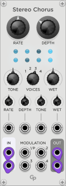
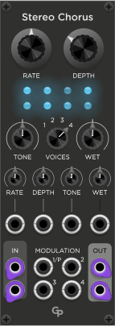

**Stereo Chorus - Chorus effect with up to four stereo voices**

 &nbsp; &nbsp; &nbsp;

The Chorus effect adds complexity to signals by duplicating input signals and applying pitch modulation to them.

* Four internal LFOs to control 4 Stereo voices.
* The four LFOs are slightly detuned from each other to add complexity.
* Left and right channels of one voice are modulated from the same internal LFO, but with a 90-degree phase offset.
* External modulation is available through four modulation inputs.
* For external modulation the left and right parts of a voice are fully independent of each other.
* Each modulation input can accept a polyphonic cable and use channel 2 for the right channel modulation.
* As an alternative, Modulation input 1 can supply eight channels of modulation for all voices on one polyphonic cable, left and right. Channels 1 through 4 control the left part of voices 1 through 4, channel 5 through 8 control the right parts.
* You can use the VCV MERGE module to merge eight modulation sources (i.e. eight LFOs) into one polyphonic cable.
