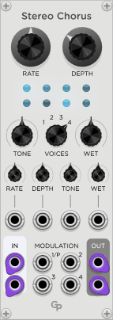
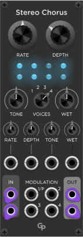
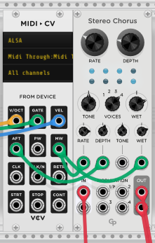

<h1>Stereo Chorus</h1>

 &nbsp; &nbsp; &nbsp;

<h2>Features</h2>

The Chorus effect adds complexity to signals by duplicating input signals and applying pitch modulation to them.

* Four internal LFOs to control four Stereo voices.
* Left and right channels of one voice are modulated from the same internal LFO, but
with a 90-degree phase offset.
* Additional or exclusive external modulation of all eight independent circuits is available through modulation inputs.
* CV inputs with attenuverters can control most parameters. 

<h2>Sockets</h2>

* One or two audio inputs can be fed into the **IN** sockets in the lower left corner
of the front panel. The **IN** sockets will accept all signals from polyphonic cables
and sum them together before going into the monophonic signal processing.
* The processed signal is provided in the **OUT** section in the lower right corner.
If both audio IN and OUT are stereo, there is no audio crossfeeding between channels,
so Stereo Chorus can be used as a dual Mono Chorus with a shared set of parameters.
The **OUT** sockets provide a monophonic signal.
* **MODULATION** inputs 1 through 4 accept voltages for external
modulation of the voices. Each modulation input can accept polyphonic cables and will
use a signal on channel 2 for independent modulation of the right channel of each voice.
Modulation input 1 is marked **1/P**, since it can also be used to modulate all eight
circuits with one polyphonic cable. The polyphonic cable must carry exactly eight channels,
regardless of the number of voices selected in Stereo Chorus.
You can use the VCV MERGE module to combine eight modulation sources into one cable and
plug that into modulation input **1/P**. Channels 1 through 4 control the left side if
the voices, channels 5 through 8 control the right sides. Set the number of channels in
the MERGE modules to eight.
* The **RATE**, **DEPTH**, **TONE** and **WET** control voltages are multiplied with
the respective attenuverters and then applied to parameters in addition to the values
adjusted with the front panel knobs. See below for details.

<h2>Parameters</h2>

<h3>Main Parameters</h3>

<h4>RATE</h4>

The **RATE** parameter controls the frequency of the internal LFOs in a range
from 1 to 10 Hz. If you turn the **RATE** knob all the way down, the internal LFOs
will be deactivated and only external modulation will take place. Please note that
switching to "External Modulation Only" and back will lead to a sudden jump in
delay with a little click. Therefore, this LFO deactivation is not accessible
through the **RATE** control voltage.

<h4>DEPTH</h4>

The **DEPTH** parameter determines the amount of pitch modulation taking place.
Normally this also depends on the frequency of the modulation signal, but for the
internal LFOs this gets compensated, so regardless of the **RATE** setting pitch
variation at the maximum **DEPTH** setting will be about +/- one semitone.

<h4>TONE</h4>

The **TONE** parameter controls the frequency content of the wet signal. If turned
to the left (values -100% to -1%) a lowpass is applied to make the signal sound darker.
If turned to the right (1% to 100%) a highpass will cut away some of the low frequencies
to provide a clearer, less muddy signal.

<h4>VOICES</h4>

The **VOICES** parameter determines how many voices are active. More voices give a
more complex signal. If more than one voice is activated, the internal LFOs are detuned
against each other by a few percent.

<h4>WET</h4>

The **WET** parameter defines the mix between the input signal and the processed
effect signal.

<h3>Attenuverters</h3>

The four attenuverters determine the amount of CV control for their respective parameters.
In the middle position the CV input is inactive. They are applied as a factor to the
control voltages between -1 (displayed as -100%, inverts the CV) and 1 (100%, no inverting).

To be able to sweep the whole range of the **RATE**, **DEPTH** and **WET** parameters
with a 0 to 10 V control voltage, set the knob for the parameter to the minimum position and turn the
attenuverter to 100%. For inverted control turn the parameter knob to its max position and
set the attenuverter to -100%.

For the **TONE** parameter, set the **TONE** knob to the middle position and set the
attenuverter to -100% or 100% to be able to sweep the full range with CV.

Smaller percent values than +/- 100% reduce the parameter changes by the CV inputs accordingly.
<h2>External Modulation</h2>
The internal LFOs and the parameter ranges were chosen to achieve
musical results. Especially the limitation of pitch changes based on
the LFO frequency makes it impossible to do really outlandish things.
While the internal LFOs are active, external modulation is also reduced
by 50% to achieve a complex mix of internal and external modulation.

If you want to explore wilder sounds, turn the **RATE** knob all the
way down, **RANGE** all the way up and use external modulation only.
In this mode a 1 Hz sine wave modulation will create about +/- one
semitone of pitch modulation, higher modulation frequencies can
result in much higher pitch changes.

<h2>Sample Applications</h2>

 
**CV Control with MIDI Modulation Wheel**
 

 
**External eight channel modulation using the VCV MERGE module**
