# GPaudio Plugin for VCV Rack 2 by GPaudio

**GPaudio** is a suite of modules for the virtual **VCV Rack 2** modular synthesizer

<h2>Modules</h2>

The following modules are included:

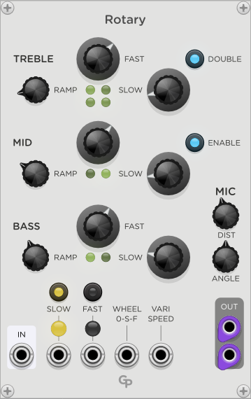 &nbsp; &nbsp; &nbsp;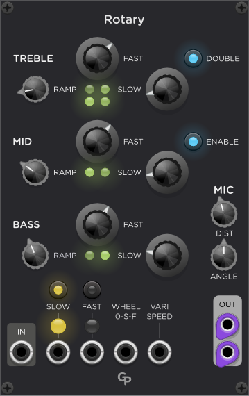 
[Rotary](Rotary.html) – An enhanced emulation of rotating speaker cabinets. 
  

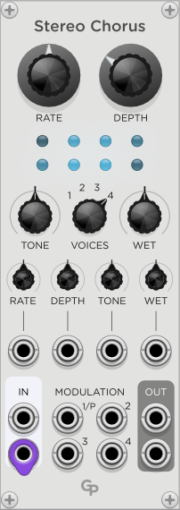 &nbsp; &nbsp; &nbsp;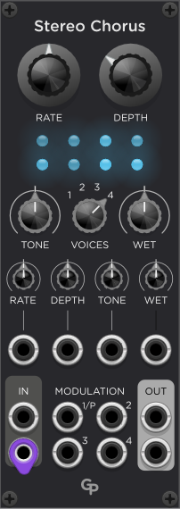 
[Stereo Chorus](StereoChorus.html) – A chorus effect with up to four stereo voices with external control and modulation through CV inputs
  
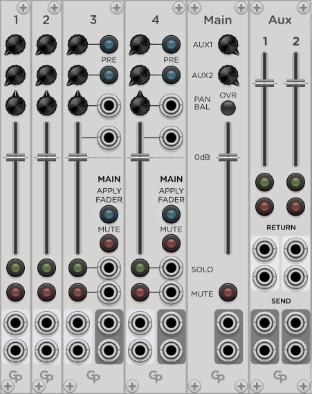  &nbsp; &nbsp; &nbsp;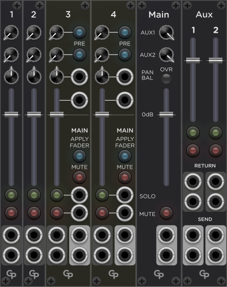 
[Chained Mixer](ChainedMixer.html) – A Modular stereo mixer, including two different Input channels, a Main and an Aux section
  
 &nbsp; &nbsp; &nbsp; 
[Clamp](Clamp.html) – Lmit V/Oct to a note range
  
 &nbsp; &nbsp; &nbsp;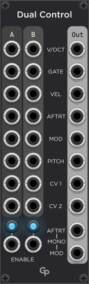 &nbsp; &nbsp; &nbsp;
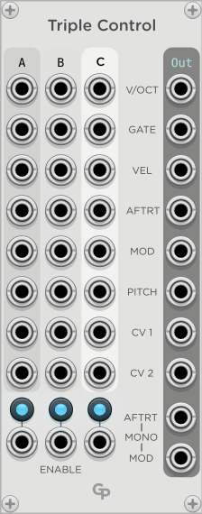 &nbsp; &nbsp; &nbsp; 
[DualControl](DualTripleControl.html) and [TripleControl](DualTripleControl.html) – Merge multiple polyphonic controllers and sequencers
  
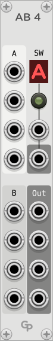 &nbsp; &nbsp; &nbsp;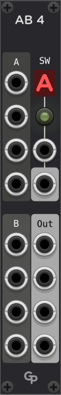 &nbsp; &nbsp; &nbsp;
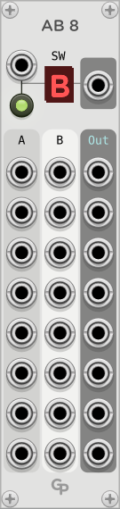 &nbsp; &nbsp; &nbsp;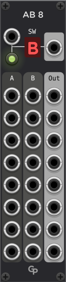 
[AB4](AB4.html) and [AB8](AB8.html) – 4 and 8 channel AB switchers for audio and control voltages

<h2>Change Log</h2>

The change log [can be found here](changelog.html)