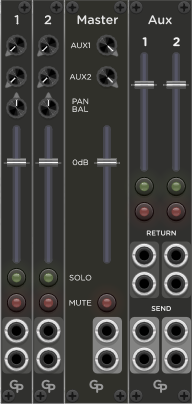

# GP Plugin for VCV Rack 2 by GPaudio

**GP** is a suite of miscellaneous modules for the virtual **VCV Rack 2** modular synthesizer

<h2>Modules</h2>

The following modules are included:

 &nbsp; &nbsp; &nbsp; 
[Stereo Chorus](StereoChorus.html) – A chorus effect with up to four stereo voices with external control and modulation through CV inputs
  
  &nbsp; &nbsp; &nbsp; 
[Chained Mixer](ChainedMixer.html) – Modules for a modular stereo mixer, including Input channels, a Master section and an Aux section
   
 &nbsp; &nbsp; &nbsp; 
[AB4](AB4.html) – 4 channel AB switcher for audio, triggers and control voltages

<h2>Change Log</h2>

The change log [can be found here](changelog.html)